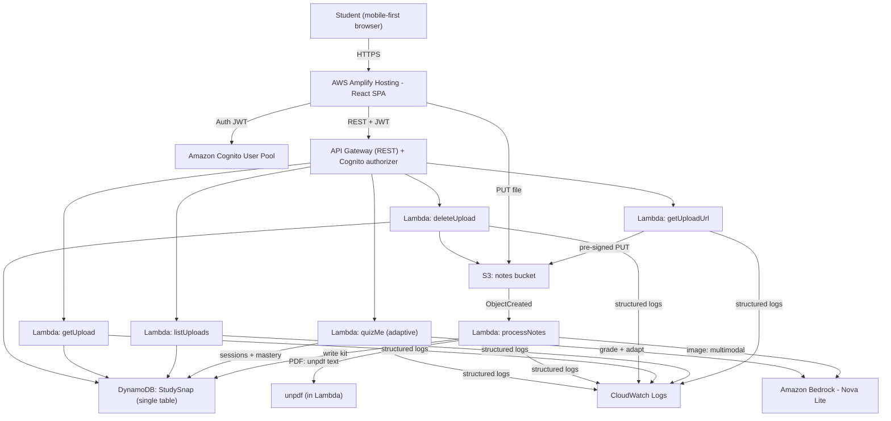

# StudySnap 

**Turn any lecture notes into summaries, flashcards, and quizzes in seconds.**

StudySnap is an AI study assistant. Students upload lecture notes (PDFs or photos of
messy handwritten notes) and get an instant study kit: a **summary**, **10 flashcards**,
and **5 quiz questions** — plus the differentiator, **Adaptive Quiz-Me**: a conversational
tutor that grades your free-text answers, explains mistakes, adapts questions to your weak
topics, and tracks per-topic mastery.

Built for the AWS **"Zero to Shipped"** hackathon · Lane: `#social-good (education) + #community`

- 🌐 **Live demo:** https://main.d1wkxjr5bl55l7.amplifyapp.com/
- 🔌 **API health:** https://u1g7hquhsf.execute-api.us-east-1.amazonaws.com/prod/health

---

## Architecture



**Flow:** upload → pre-signed S3 PUT → `ObjectCreated` triggers `processNotes` (async, so we
never hit the API Gateway 29s limit) → Amazon Nova generates a strict-JSON study kit → stored
in DynamoDB → dashboard polls until `READY`. Quiz-Me is a stateful loop over the same kit.

---

## Tech stack

| Layer | Choice |
|-------|--------|
| Frontend | React + Vite, **AWS Amplify Hosting** (HTTPS + CDN) |
| Auth | **Amazon Cognito** + Amplify Authenticator drop-in |
| API | **API Gateway (REST)** + Cognito authorizer |
| Compute | **AWS Lambda** (Node.js 22, TypeScript) |
| AI | **Amazon Bedrock — Amazon Nova Lite** (multimodal); Claude wired as env fallback |
| Storage | **Amazon S3** (uploads) + **DynamoDB** (single table, on-demand) |
| PDF | `unpdf` (serverless, in-Lambda) — no Textract |
| IaC | **AWS CDK (TypeScript)** — one command deploys the whole stack |
| CI/CD | **GitHub Actions** — push to `main` → lint/test/build → deploy |
| Cost guard | **CloudWatch $20 billing alarm** |

---

## API

All routes require a Cognito JWT (`Authorization: Bearer <token>`) except `/health`.

| Method | Route | Purpose |
|--------|-------|---------|
| GET | `/health` | Public liveness check |
| GET | `/uploads` | List the current user's uploads |
| POST | `/uploads` | Get a pre-signed upload URL (validates type/size) |
| GET | `/uploads/{id}` | Get one upload + generated kit |
| DELETE | `/uploads/{id}` | Delete upload + kit + progress (S3 + DynamoDB) |
| POST | `/uploads/{id}/quiz-me` | Adaptive Quiz-Me session (`start` / `answer` / `end`) |

---

## Setup / deploy

**Prerequisites:** Node 22+, AWS CLI configured (`aws configure`), AWS CDK, an AWS account
with Amazon Bedrock **Amazon Nova** access in `us-east-1`.

```bash
# 1. Install
npm install

# 2. Bootstrap CDK (once per account/region)
cd infra && npx cdk bootstrap && cd ..

# 3. Deploy the backend (API, Lambdas, DynamoDB, S3, Cognito, $20 alarm)
#    Pass an email to receive the billing alarm:
npm run deploy -- -c alarmEmail=you@example.com

# 4. Frontend: connect the repo to Amplify Hosting (one-time)
#    Amplify console -> app -> "Connect repository" -> GitHub -> this repo, branch main.
#    Amplify reads amplify.yml and auto-builds/deploys on every push to main.
npm --workspace web run build   # optional local build
```

**CI/CD:** GitHub Actions runs lint/test/typecheck/build on every push (secret-free).
The **frontend** auto-deploys via Amplify Hosting's Git integration; the **backend**
deploys with `npm run deploy` (CDK).

The CDK stack outputs the API URL, Cognito IDs, bucket, and table names. The frontend reads
these via `VITE_*` env vars (see `web/.env.example`), defaulting to the deployed stack.

**Model config** (env vars on the Lambdas):
- `AI_MODEL_ID` — primary model (default `us.amazon.nova-lite-v1:0`)
- `QUIZ_MODEL_ID` — per-feature model for Quiz-Me (defaults to primary; can be Nova Pro)
- Flip to Claude by setting `AI_MODEL_ID=us.anthropic.claude-haiku-4-5-20251001-v1:0`
  (requires Anthropic Bedrock access on the account).

---

## Screenshots

> _Add screenshots here for the submission:_
- [ ] Login / signup (Amplify Authenticator)
- [ ] Dashboard with study kits
- [ ] Upload (camera-first)
- [ ] Kit detail — Summary / Flashcards / Quiz
- [ ] **Quiz-Me** chat with grade badges + mastery bars
- [ ] CloudWatch structured logs
- [ ] $20 billing alarm

---

## How I used AI agents + AWS

**Kiro (agentic IDE)** drove the whole build with a self-checking loop:
- Wrote the spec, CDK stack, all Lambdas, and the React app.
- **Automated agent hooks** (see [`AGENTS.md`](./AGENTS.md)) run on every change:
  **pre-commit** (lint + tests, blocks bad commits), **post-edit** (typecheck on save),
  and **CDK validation** (`cdk synth` on every infra change).
- Structured CloudWatch logging surfaced a real bug live (a DynamoDB reserved-word in the
  Quiz-Me mastery update) which the agent then fixed and re-verified.

**AWS** provides the entire runtime, provisioned as code (zero console clicks for the stack):
- **Amazon Bedrock (Amazon Nova Lite)** is the AI engine — summarization, flashcard/quiz
  generation, multimodal handwriting reading, and the adaptive Quiz-Me tutor.
- **Cognito, API Gateway, Lambda, S3, DynamoDB, CloudWatch** run the app; **Amplify Hosting**
  serves the frontend over HTTPS; **AWS CDK** expresses all of it in TypeScript.

> **Note on the model:** the spec targeted Anthropic Claude, but this AWS account cannot
> complete the Claude **Marketplace subscription** (`INVALID_PAYMENT_INSTRUMENT`). Rather than
> gamble the ship deadline on a billing fix, StudySnap uses **Amazon Nova Lite** — a
> first-party Bedrock model that's multimodal, fast, and cheap. The AI layer is a pluggable
> seam, so flipping back to Claude is a one-env-var change. Proven end-to-end on Nova.

---

## Cost

Tiny. Amazon Nova Lite is low-cost per token; DynamoDB is on-demand; S3/Lambda/Amplify sit in
free-tier territory for hackathon usage. A **$20 CloudWatch billing alarm** guards against
surprises, plus client-side image downscaling (≤1568px) and a Quiz-Me context cap (last 10
turns) keep token usage bounded.

---

## Project structure

```
infra/       AWS CDK app (StudySnapStack) — all infrastructure as code
services/    Lambda handlers (TypeScript) + shared lib (aiClient, auth, http, logger)
web/         React + Vite frontend (Amplify Authenticator, dashboard, kit, Quiz-Me)
.kiro/hooks/ Kiro agent hooks (pre-commit, post-edit, cdk-validate)
spec.md      Full specification
tasks.md     Build-ordered task log
AGENTS.md    Agentic workflow + Kiro→AWS connection proof
```
