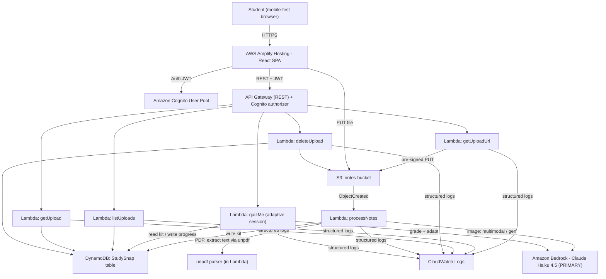

# StudySnap — Specification (spec.md)

> AWS "Zero to Shipped" Hackathon (Builder Center) · Deadline: **Oct 2**
> Lane: **#social-good (education) + #community**
> One-line pitch: **"Turn any lecture notes into summaries, flashcards, and quizzes in seconds."**
> Status: **APPROVED (with 7 review changes applied). Build proceeds per tasks.md.**

---

## 0. AI Backend — VERIFIED (Step 0)

Confirmed by live `bedrock-runtime invoke-model`, not assumption:

- **Account:** `<AWS_ACCOUNT_ID>` · **IAM user:** `<IAM_USER>` · **Region:** `us-east-1`
- **PRIMARY model (everything — kit generation, vision/handwriting, Quiz-Me turns):**
  **Amazon Nova Lite** `us.amazon.nova-lite-v1:0` — first-party AWS Bedrock model,
  multimodal, low latency/cost. **Proven by live invocation** (real READY kit: 10 flashcards
  + 5 quiz; Quiz-Me free-text grading verified correct/partial/incorrect).
- **Quiz-Me model (per-feature, configurable):** `QUIZ_MODEL_ID`, defaults to Nova Lite.
  Nova Lite grading tested strong; flip to `us.amazon.nova-pro-v1:0` if any case disappoints.
- **Fallback (config flag only):** Anthropic **Claude Haiku 4.5**
  `us.anthropic.claude-haiku-4-5-20251001-v1:0` (Sonnet 4.5 also wired). Enabled via
  `AI_MODEL_ID` **if** the Anthropic Marketplace subscription clears on this account.
  > Why not Claude as primary: this account (AWS India / UPI billing) cannot complete the
  > Anthropic **Marketplace subscription** (`INVALID_PAYMENT_INSTRUMENT`), which blocks
  > `InvokeModel` for Claude — confirmed in the console playground too. Nova is first-party
  > and unaffected. One env var flips back to Claude if billing ever resolves.
- **Pluggable `aiClient` seam:** model id read from config/env; `aiClient` formats requests
  per family (Nova Converse-style vs Anthropic Messages). Swapping models touches no
  business logic. IAM allows `bedrock:InvokeModel` on Nova (Lite+Pro) and Claude ARNs.

**Vision path:** handwritten/photo notes are sent directly to Amazon Nova (multimodal).
PDFs have text extracted in-Lambda with `unpdf` (serverless-friendly, no Textract).

---

## 1. Product Summary

StudySnap turns lecture notes into a study kit. Students upload a PDF or a **photo of
messy handwritten notes** (camera-first UX). Claude Haiku 4.5 generates a **summary**,
**10 flashcards**, and **5 quiz questions**. The differentiator is **Adaptive Quiz-Me Mode**:
a conversational agent that quizzes the student, grades each answer, explains mistakes,
adapts follow-up questions toward weak topics, and tracks per-topic mastery over time.

**Principle:** tight MVP scope, managed AWS services over custom code, one-command deploy,
live public HTTPS URL by Oct 2. Shipping beats perfection.

---

## 2. User Stories

### Auth
- **US-1** Sign up with email + password (private account).
- **US-2** Log in / log out securely.
- **US-3** See only my own uploads, kits, and progress.

### Upload & Generate
- **US-4** Upload a PDF, or snap/upload a photo of handwritten notes.
- **US-5** See upload progress and clear validation errors.
- **US-6** Auto-generate summary + 10 flashcards + 5 quiz questions.
- **US-7** See a processing state while AI runs, then results.

### Adaptive Quiz-Me (differentiator)
- **US-8** Start a chat-style Quiz-Me session from any study kit.
- **US-9** Answer in natural language; the agent grades each answer (correct/partial/incorrect).
- **US-10** Get an explanation when I'm wrong, tied to the source notes.
- **US-11** The agent adapts follow-ups toward my weak topics.
- **US-12** My per-topic mastery is saved and shown over time.

### Dashboard & Review
- **US-13** See past uploads with status + date.
- **US-14** Open a kit: read summary, flip flashcards, take the static quiz.
- **US-15** See quiz progress / weak-topic breakdown per kit.
- **US-16** Delete an upload and all its generated content + progress.

### Non-goals (MVP)
Sharing/collab, spaced repetition scheduling, payments, editing generated content,
native apps, token streaming. **Stretch only if ahead:** timed exam mode, study-plan generator.

---

## 3. Functional Requirements

| ID | Requirement | Priority |
|----|-------------|----------|
| FR-1 | Cognito signup/login/logout | Must |
| FR-2 | Upload PDF/PNG/JPG (max 10 MB) to S3 via pre-signed URL; **images client-side downscaled to max ~1568px longest side before upload** (in addition to the 10 MB cap) to cut Bedrock token burn + latency | Must |
| FR-3 | Client-side validation: file type + size, **then downscale images to ≤1568px longest side (JPEG re-encode) before requesting the upload URL** | Must |
| FR-4 | On upload: PDF text extracted in-Lambda via `unpdf`; images sent to Claude Haiku multimodal | Must |
| FR-5 | Generate 1 summary, exactly 10 flashcards, exactly 5 quiz MCQs (4 options + answerIndex) | Must |
| FR-6 | Persist kit + metadata in DynamoDB | Must |
| FR-7 | Dashboard lists uploads (PROCESSING/READY/FAILED) | Must |
| FR-8 | Kit detail: summary, flashcard flip, static quiz reveal | Must |
| FR-9 | **Quiz-Me**: stateful chat session, per-answer grading, explanations, adaptive follow-ups | Must |
| FR-10 | **Quiz-Me**: persist per-topic mastery + session history in DynamoDB | Must |
| FR-11 | Delete upload (S3 object + all DynamoDB items) | Should |
| FR-12 | Structured JSON logging to CloudWatch in every Lambda | Must |
| FR-13 | Graceful error + retry messaging on frontend | Must |
| FR-14 | Mobile-friendly, camera-first upload | Must |

---

## 4. Architecture

### 4.1 High-level (Mermaid)



### 4.2 Processing flow (generation)
1. Client validates file (type/size) → `POST /uploads` → pre-signed PUT URL + `uploadId`.
2. Client PUTs file to S3.
3. S3 `ObjectCreated` triggers `processNotes` (async — avoids API Gateway 29s limit).
4. PDF → in-Lambda text extract; image → Claude multimodal.
5. One Claude call returns strict JSON (summary, 10 flashcards, 5 quiz). Backend validates
   shape/counts, retries once on bad JSON, writes kit + status `READY` (or `FAILED`).
6. Dashboard polls `GET /uploads/{id}` until `READY`.

### 4.3 Quiz-Me flow (adaptive, stateful)
1. Client `POST /uploads/{id}/quiz-me` with `{action:"start"}` → server seeds a session from
   the kit, picks a first question, returns `sessionId` + question.
2. Client sends `{action:"answer", answer:"..."}`; server loads session + kit context, calls
   Claude Haiku to **grade** (correct/partial/incorrect), **explain**, and **choose the next
   question** biased toward weak topics.
3. Server updates per-topic mastery + appends turn to session history in DynamoDB, returns
   grade + explanation + next question.
4. Repeats until `{action:"end"}`; final summary of mastery returned and persisted.

**Context cap (cost/latency guard):** although the full session history is persisted in
DynamoDB, the prompt sent to Claude on each turn includes **only the last 10 turns** plus
the kit summary, topics, and current mastery — never the unbounded full history.

### 4.4 Ship-fast rationale
- **Async S3 trigger** keeps long AI work out of the request path.
- **No Textract** → cheaper/simpler; PDFs parsed in-Lambda with `unpdf`, images use Claude vision.
- **Single primary model — Claude Haiku 4.5 — for everything** (kit generation, vision, and
  Quiz-Me turns): low latency + low cost, and one prompt-tuning target / one IAM policy.
  Sonnet 4.5 sits behind an env flag as a quality fallback only.
- **Single DynamoDB table**, on-demand → zero capacity planning.
- **Amplify Hosting** → HTTPS + CDN + CI/CD out of the box.

---

## 5. API Contracts (REST · API Gateway · Cognito authorizer)

All routes require `Authorization: Bearer <Cognito JWT>`. `userId` = JWT `sub`
(server-derived, never trusted from client). JSON in/out.

### 5.1 `POST /uploads` — pre-signed upload URL
Req: `{ "fileName": "notes.pdf", "contentType": "application/pdf", "fileSize": 482113 }`
Res 200: `{ "uploadId": "...", "uploadUrl": "https://s3...", "s3Key": "uploads/<userId>/<uploadId>/notes.pdf", "expiresIn": 300 }`
Errors: 400 bad type/size · 401 · 413 too large.

### 5.2 `GET /uploads` — list my uploads
Res 200: `{ "items": [ { "uploadId","fileName","status","createdAt" } ] }`

### 5.3 `GET /uploads/{uploadId}` — kit detail
Res 200 (READY):
```json
{
  "uploadId": "...", "fileName": "notes.pdf", "status": "READY",
  "createdAt": "2026-09-28T10:00:00Z",
  "summary": "…",
  "topics": ["Cell structure","Mitosis","Genetics"],
  "flashcards": [ { "front": "…", "back": "…" } ],
  "quiz": [ { "question": "…", "options": ["a","b","c","d"], "answerIndex": 1, "topic": "Mitosis" } ]
}
```
`status` may be `PROCESSING` (no content) or `FAILED` (+`error`).

### 5.4 `DELETE /uploads/{uploadId}` — delete kit + progress + S3 object → 204

### 5.5 `POST /uploads/{uploadId}/quiz-me` — adaptive session
Start req: `{ "action": "start" }`
Start res 200: `{ "sessionId":"…", "question":{ "text":"…","topic":"Mitosis" }, "progress":{...} }`

Answer req: `{ "action":"answer", "sessionId":"…", "answer":"free text" }`
Answer res 200:
```json
{
  "grade": "correct | partial | incorrect",
  "explanation": "why, tied to the notes",
  "nextQuestion": { "text": "…", "topic": "Genetics" },
  "progress": { "Mitosis": {"asked":2,"correct":1}, "Genetics": {"asked":1,"correct":0} }
}
```
End req: `{ "action":"end", "sessionId":"…" }`
End res 200: `{ "summary":"session recap", "mastery": {"Mitosis":0.5,"Genetics":0.0} }`

### 5.6 Status codes
200 · 204 · 400 · 401 · 403 not owner · 404 · 413 · 500.

---

## 6. Data Model (DynamoDB — single table `StudySnap`, on-demand)

| Entity | PK | SK | Key attrs |
|--------|----|----|-----------|
| Upload/kit | `USER#<userId>` | `UPLOAD#<uploadId>` | fileName, s3Key, contentType, status, summary, topics[], flashcards[], quiz[], error, createdAt, updatedAt |
| Quiz-Me session | `USER#<userId>` | `SESSION#<uploadId>#<sessionId>` | history[] (turns), currentTopic, createdAt, endedAt |
| Per-topic mastery | `USER#<userId>` | `MASTERY#<uploadId>#<topic>` | asked, correct, partial, score (0..1), updatedAt |

**Access patterns**
- List uploads: `Query PK=USER#<userId>, SK begins_with UPLOAD#`.
- Get kit: `GetItem`.
- Load session: `GetItem SESSION#...`; update mastery: `UpdateItem MASTERY#...`.
- Delete kit: delete `UPLOAD#`, all `SESSION#<uploadId>#*`, all `MASTERY#<uploadId>#*` + S3 object.

Ownership enforced because `PK` is bound to the JWT-derived `userId`.

---

## 7. AI Prompt Contracts (Claude)

### 7.1 Kit generation (Claude Haiku 4.5 — PRIMARY, one call)
Strict-JSON output:
```json
{
  "summary": "<= 250 words",
  "topics": ["3-6 short topic labels"],
  "flashcards": [ { "front": "...", "back": "..." } ],
  "quiz": [ { "question":"...", "options":["a","b","c","d"], "answerIndex":0, "topic":"..." } ]
}
```
Rules: exactly 10 flashcards, exactly 5 quiz items, 4 options each, valid `answerIndex`,
every quiz item tagged with a topic from `topics`. Validate; one retry; else `FAILED`.

### 7.2 Quiz-Me turn (Claude Haiku 4.5 — PRIMARY)
Input: kit summary + topics + current mastery + **last 10 turns only** + student answer.
Strict-JSON output:
```json
{ "grade":"correct|partial|incorrect", "explanation":"...", "nextTopic":"...", "nextQuestion":"..." }
```
Next topic biased toward lowest-mastery topics. Backend updates mastery counters.

> Both 7.1 and 7.2 target the single primary model id (`AI_MODEL_ID`, default Haiku 4.5).
> Flipping to the Sonnet 4.5 fallback is an env-var change, no code change.

---

## 8. Design (page structure, wireframes, color scheme)

### 8.1 Color scheme
- **Primary** Indigo `#4F46E5` · **Primary-dark** `#4338CA`
- **Accent** Emerald `#10B981` (success/correct) · **Warning** Amber `#F59E0B` (partial)
- **Error** Rose `#EF4444` · **Ink** `#0F172A` · **Surface** `#FFFFFF` · **Muted bg** `#F8FAFC`
- Rounded-2xl cards, soft shadows, generous spacing, large tap targets (mobile-first).
- System font stack (Inter if available). WCAG AA contrast on text/controls.

### 8.2 Pages
1. **Auth** (`/login`, `/signup`) — Cognito-backed forms, inline validation, error toasts.
2. **Dashboard** (`/`) — grid of upload cards (filename, status pill, date), big "＋ Upload" FAB.
3. **Upload** (`/upload`) — camera-first: "Take photo / Choose file", type+size validation,
   progress bar, then redirect to kit detail in PROCESSING state.
4. **Kit detail** (`/kits/:id`) — tabs: **Summary** · **Flashcards** (flip cards) ·
   **Quiz** (static 5-Q reveal) · **Quiz-Me** (chat). Header shows status + weak-topic chips.
5. **Quiz-Me** (within kit) — chat transcript, answer input, per-turn grade badge
   (green/amber/red), live mastery bars per topic, "End session" → recap.

### 8.3 Described wireframes
- **Dashboard (mobile):** top bar (logo + avatar/logout); scrollable card list; sticky FAB
  bottom-right; empty state with illustration + "Upload your first notes".
- **Upload:** centered dropzone card; camera icon primary button; helper text
  "PDF, PNG, JPG · max 10 MB"; images auto-downscaled to ≤1568px before upload; progress bar; cancel link.
- **Kit detail:** sticky tab bar; Summary = readable prose card; Flashcards = swipeable
  deck with flip animation + counter (e.g. 3/10); Quiz = one card per question, tap to
  reveal answer with correct highlighted.
- **Quiz-Me:** chat bubbles (agent left, student right); grade badge on each graded answer;
  collapsible "mastery" panel with horizontal bars; input pinned to bottom.

### 8.4 UX states (every async view)
Loading (skeleton/spinner) · Empty · Error (message + retry) · Success. Optimistic where safe.

---

## 9. Tech Stack (locked)
- **Frontend:** React (Vite) on **AWS Amplify Hosting**.
- **Backend:** **Lambda (Node.js)** + **API Gateway (REST)** with **Cognito authorizer**.
  One language across CDK + Lambdas + frontend (fewer context switches in a sprint).
- **PDF text extraction:** **`unpdf`** (serverless-friendly), in-Lambda — no Textract.
- **Storage:** **S3** (uploads), **DynamoDB** (single table).
- **AI:** **Amazon Bedrock — Amazon Nova Lite** as PRIMARY for generation, vision, and
  Quiz-Me (`QUIZ_MODEL_ID` allows Nova Pro for the quiz path). Anthropic Claude wired as an
  `AI_MODEL_ID` fallback (blocked on this account by Marketplace billing; see §0).
- **Auth:** **Cognito** User Pool + the **Amplify Authenticator drop-in React component**
  (no Hosted UI redirect-flow debugging).
- **IaC:** **AWS CDK (TypeScript)** — one command deploys the full stack. Zero console clicks
  (Bedrock model access already enabled). Includes a **$20 billing alarm** (see §13).
- **CI/CD:** **GitHub Actions** — push to `main` → build + deploy.

---

## 10. Agentic Workflow (judged)
- Kiro hooks: **pre-commit** (lint + tests), **post-edit** (verify compile/typecheck),
  **CDK validation** (`cdk synth`) on every infra change. Documented in **AGENTS.md**.
- **Documented proof of Kiro → AWS console connection** (steps + screenshots) — qualification
  requirement. Captured during first deploy.

---

## 11. Risks & Fallbacks
| Risk | Fallback |
|------|----------|
| Newer Claude needs inference profile | Use `us.` profile IDs (already confirmed) |
| Claude returns invalid JSON | Validate + one retry, else `FAILED` surfaced in UI |
| Handwriting OCR quality | Haiku multimodal; prompt asks it to note illegible parts; flip `AI_MODEL_ID` to Sonnet 4.5 if quality disappoints |
| Quiz-Me latency/cost | Haiku model; capped context (summary+topics+mastery+last 10 turns) |
| Runaway AWS cost | **$20 billing alarm** in CDK (§13); on-demand DynamoDB; image downscale |
| API Gateway 29s timeout | Async S3-trigger generation + polling |
| Deploy blocked | Amplify Hosting is independent of stack; ship frontend first if needed |

---

## 12. Acceptance Criteria (MVP done)
- Live public HTTPS URL; signup/login works.
- Upload a PDF and a handwritten photo; both produce summary + 10 flashcards + 5 quiz.
- Quiz-Me: grades answers, explains mistakes, adapts to weak topics, persists mastery.
- Dashboard shows uploads with correct status transitions; delete removes S3 + DDB.
- One-command CDK deploy; GitHub Actions deploys on push to main.
- CloudWatch shows structured logs per Lambda.
- **Day-1 ship gate:** skeleton stack (CDK + CI + `/health` endpoint) live at a public
  HTTPS URL **before any feature work** (tasks.md task #1).
- **$20 billing alarm** provisioned by CDK.

---

## 13. Cost Guardrail — $20 Billing Alarm (non-negotiable)
- CDK provisions a **CloudWatch billing alarm at $20 USD** on the `EstimatedCharges` metric
  (namespace `AWS/Billing`, currency USD, region `us-east-1` where billing metrics live).
- Alarm notifies an **SNS topic** subscribed to the account owner's email.
- Deployed as part of the Day-1 skeleton stack so the guardrail exists before any AI spend.
- Complementary controls: on-demand DynamoDB, client-side image downscale (≤1568px),
  Quiz-Me context cap (last 10 turns), single low-cost primary model (Haiku).

---

## 14. Day-1 Milestone (ship gate first)
Before any feature: deploy a **skeleton** proving the pipeline end to end —
1. CDK app that synthesizes and deploys: API Gateway + one `GET /health` Lambda returning
   `{status:"ok"}`, the `StudySnap` DynamoDB table, S3 bucket, Cognito User Pool, and the
   $20 billing alarm.
2. GitHub Actions workflow: push to `main` → `cdk deploy` (backend) + Amplify build (frontend).
3. React app shell deployed to Amplify Hosting, reachable at a **public HTTPS URL**, that
   calls `/health` and renders "ok".
Only once this URL is live do we build auth → upload → generation → Quiz-Me.

---

_End of spec.md — APPROVED with the 7 review changes applied. Proceeding to tasks.md._
